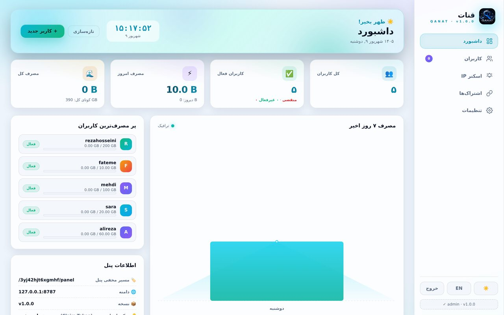
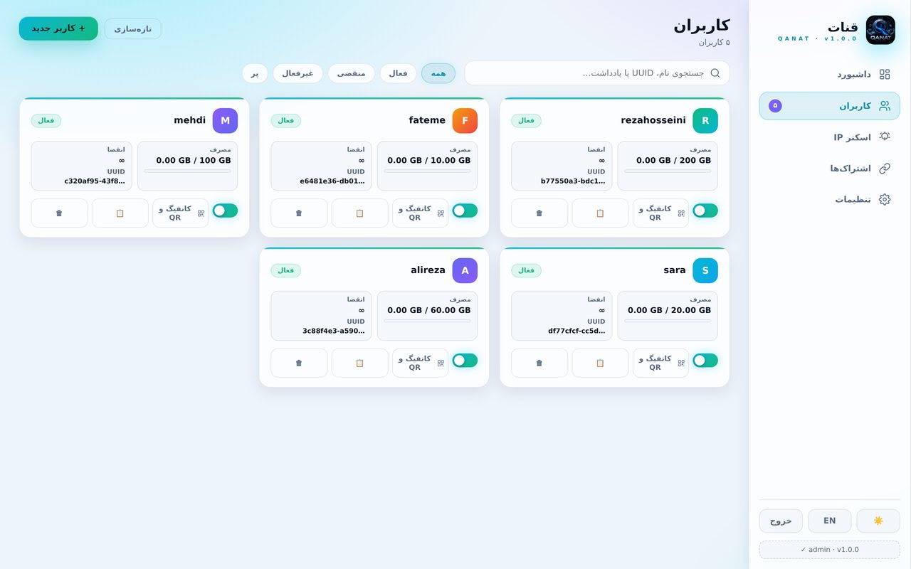
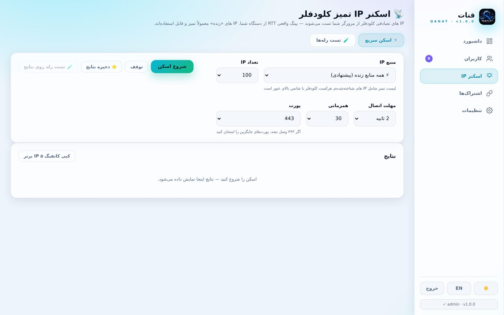
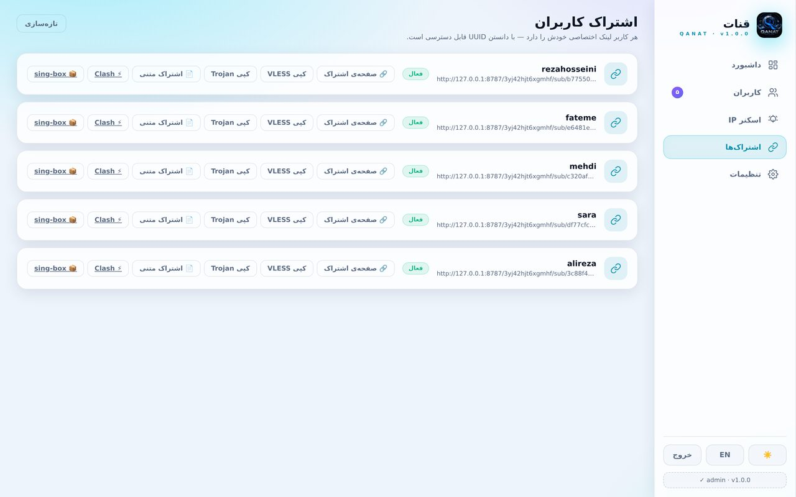
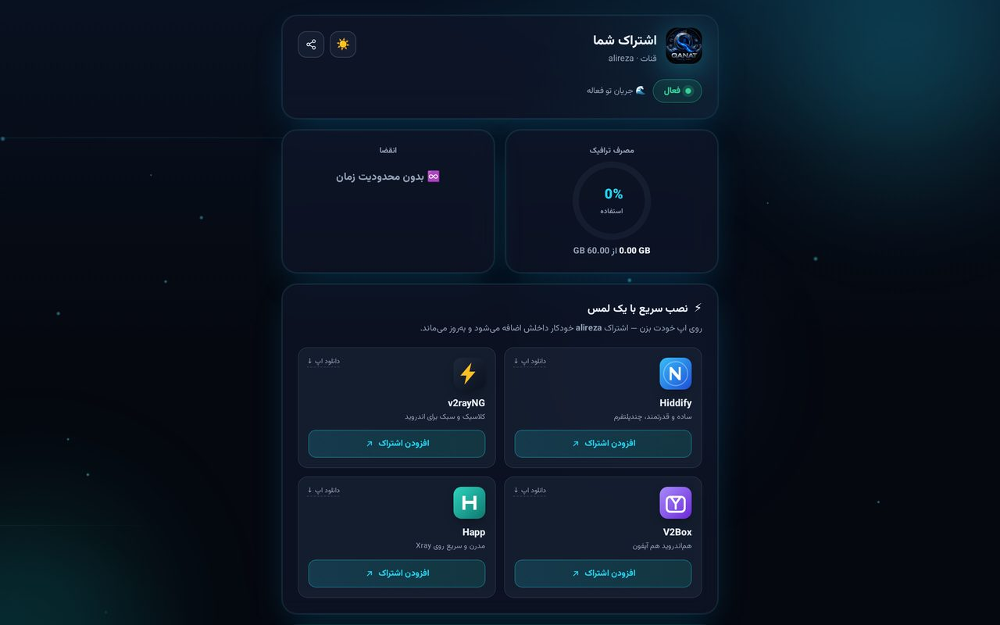
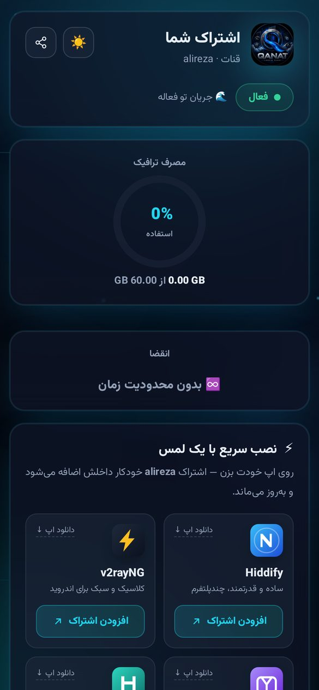

<p align="center">
  
</p>

<p align="center">
  <a href="README.md"></a>
  
  
  
  
  
  
  
</p>

> **Qanat** (قنات) — the ancient Persian underground aqueduct that carries water silently through the desert. This panel does the same for your data: it flows **past censorship, silently, under the radar**.

**Qanat** is a modern, multi-user VLESS/Trojan proxy panel that runs entirely on **Cloudflare Workers** — free forever, zero infrastructure cost.

---

## ✨ Highlights

- 🚀 **Real proxy core** — WebSocket → TCP relay with **standard VLESS & Trojan** protocols; works with v2rayNG, Hiddify, Streisand, sing-box, Clash and every VLESS-capable client
- 💸 **Free forever** — runs on the Cloudflare Workers free plan
- 🧮 **True multi-user** — users, GB quotas, expiry dates, active/inactive states — all in **Cloudflare D1**
- 🔐 **Security first** — PBKDF2 password hashing (100k iterations), JWT sessions in HttpOnly cookies, **brute-force protection**, claim-token installation security, CSRF checks
- 📱 **RTL Persian dashboard** — dark, clean, **zero external dependencies** (no CDN, no tracking)
- 📡 **Clean-IP scanner** — real ping from *your* browser across official Cloudflare ranges + **3 daily-updated sources**
- 🔗 **Per-user subscription pages** — beautiful pages with server-side **QR codes**, copy buttons and one-tap deep-links for client apps
- 🎛️ **Smart config generation** — URI / Clash / sing-box / Xray with Fragment & SNI from your proxy settings

---

## 📸 Screenshots

<details open>
<summary><b>🖥️ Admin dashboard</b></summary>
<br/>

| | |
|---|---|
|  |  |
|  |  |

</details>

<details>
<summary><b>📱 User subscription page (desktop & mobile)</b></summary>
<br/>

| | |
|---|---|
|  |  |
|  | |

</details>

---

## 🚀 Quick Start — deploy in ~3 minutes

**Prerequisites:** a free [Cloudflare](https://dash.cloudflare.com) account and [Node.js 18+](https://nodejs.org).

```bash
git clone https://github.com/qanatpanel/qanat.git
cd qanat && npm install

npx wrangler login
npx wrangler d1 create qanat-db
#    put the generated database_id into wrangler.jsonc

npm run deploy        # deploy the worker
npm run db:remote     # apply schema to D1 (optional — also automatic)
```

Done! Visit `https://<your-worker>.workers.dev` — the install page appears on first visit.

> 🔒 **Security tip:** protect the install page with a **claim token**: `?claim=your-token` — without it, installation is only allowed from the first-seen IP.

### Local development

```bash
npm run dev    # build + local wrangler server on :8787
```

---

## 🧬 Architecture

```
qanat (single-file 735KB Cloudflare Worker)
│
├── 🛡️ Security layer
│   ├── PBKDF2 (100k)          ← password hashing
│   ├── JWT + HttpOnly Cookie  ← sessions
│   ├── login_attempts (D1)    ← 10-min lock after 5 failed tries
│   └── Origin/CSRF check      ← on every POST
│
├── 🗄️ Data layer (Cloudflare D1)
│   ├── settings        ← panel settings (secure path, claim, …)
│   ├── users           ← users + quota + expiry + usage
│   └── login_attempts  ← brute-force guard
│
├── 🚀 Proxy core
│   ├── VLESS parser    ← official standard header (version/uuid/port/…)
│   ├── Trojan parser   ← password + CRLF header
│   └── WS → TCP relay  ← WebSocketPair + background loop
│
├── 📡 Feature modules
│   ├── Clean-IP scanner (3 sources + browser ping)
│   ├── Subscription page with server-side SVG QR
│   └── Config generation: URI / Clash / sing-box / Xray
│
└── 📁 Folder structure
    ├── src/auth/        🔐 authentication
    ├── src/settings/    🗄️ data
    ├── src/proxy/       🚀 proxy core
    ├── src/handlers/    📡 routes (install/login/panel/api/sub)
    ├── src/cores/       QR & config generation
    └── src/assets/      HTML pages + styles
```

---

## 🗝️ API

### Management (session required — `/{securePath}/panel/api/...`)

```
GET    /api/users              list users
POST   /api/users              create user
POST   /api/users/:id/toggle   enable/disable
DELETE /api/users/:id          delete user
GET    /api/settings           panel settings
POST   /api/settings/password  change password
POST   /api/settings/secure-path    regenerate secret path
GET    /api/clean-ips?src=…    clean IPs from 3 sources (ircf/cf2dns/bestcf/mix)
```

### User subscription

```
GET  /{securePath}/sub/{uuid}          pretty subscription page (QR + copy + deep-links)
GET  /{securePath}/sub/{uuid}/txt      plain-text subscription (v2rayN-compatible)
GET  /{securePath}/sub/{uuid}?format=clash     Clash Meta YAML
GET  /{securePath}/sub/{uuid}?format=singbox   sing-box JSON
GET  /{securePath}/sub/{uuid}?format=xray      Xray config
```

### Client connection

```
ws://your-worker.workers.dev/{proxyPath}/{uuid-or-trojan-password}
```

Fully **standard protocol** — no extra headers, no hacks. `alpn=http/1.1`, `fp=chrome`, SNI & Host from your settings.

---

## 🧪 Quality

| Script | Coverage | Result |
|---|---|---|
| `scripts/test-parser.sh` | 14 unit tests — VLESS/Trojan parsers | ✅ |
| `scripts/test-config.sh` | 24 unit tests — config generation | ✅ |
| `scripts/test-auth.sh` | 18 auth + brute-force scenarios | ✅ |
| `scripts/test-panel.sh` | 28 dashboard & users API scenarios | ✅ |
| `scripts/test-proxy.sh` | 11 E2E proxy tests (VLESS/Trojan/usage/sub) | ✅ |

**95 automated tests — all green. ✅**

E2E-verified on real Cloudflare: **clean IP → worker → YouTube → HTTP 200** (285ms).

---

## 🗺️ Roadmap

- [x] TypeScript skeleton + single-file build + Wrangler + D1
- [x] Data layer: settings + users + brute-force guard
- [x] Auth: JWT + PBKDF2 + secret path + claim token
- [x] Dashboard: overview + user CRUD + settings
- [x] Advanced proxy settings (Fragment/SNI/…) + backup/restore
- [x] Subscription/config generation: vless:// + Clash + sing-box + Xray
- [x] Proxy core: WebSocket + VLESS/Trojan
- [x] Clean-IP scanner: 3 sources + browser ping + clean-IP configs
- [ ] Telegram bot + auto-update
- [ ] IPv6 support
- [ ] Per-user rate limiting

---

## 🤝 Contributing

Issues, ideas and PRs are welcome! Before a PR:

1. Run `npm run check` (type-check)
2. Run the tests: `bash scripts/test-*.sh`
3. Add screenshots for UI changes

[Contributing guide](CONTRIBUTING.md) · [Security policy](SECURITY.md)

---

## 📜 License

[MIT](LICENSE) © 2026 [qanatpanel](https://github.com/qanatpanel)

<p align="center">
  <sub>Built with 💧 to cross any desert</sub>
</p>
